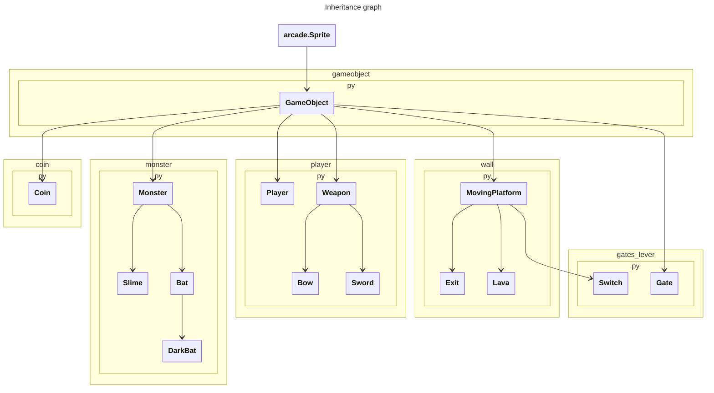

# DESIGN
## Diagramme d'Inhéritance

    
Mermaid code for the graph

## Analyse des performances :
### Génération d'une carte en fonction de n, la taille de la carte en nombre de "cellules":
On parcourt chaque "cellule" de la carte pour y lire le caractère associé, et entre autres opérations en `O(1)`, on appelle sur les blocs qui peuvent faire partie d'une plateforme la fonction `__init__` de la class Path.

Cette fonction utilise `Path.group`, qui est en `O(n)` (en vérité `O` du nombre de blocs du groupe dans lequel le bloc est, donc plus petit que `n`, mais dans le pire des cas `n`), et ensuite itère sur le groupe du blocs et les directions (`O(4n)`), puis sur les directions et la longueur de la liste de déplacement trouvée (`O(4n)`), les flèches sont dans la map), ce qui nous donne au final du `O(9n) = O(n)`.

Au final, on a donc une opération qui traverse les `n` blocs et effectue `9n` opération dessus. On a donc au final une génération de map en `O(n^2)`.

### La fonction update en fonction de k, le nombre d'entités (GameObject) présentes:
On considère ici que la vérification des collisions avec les autres objets est en `O(k)` dans le pire des cas.

Les mécanismes appelés dans le `update` sont tous en `O(1)` ou en `O(k)`. En effet, les seules opérations effectuées dans le `update` sont :

1. Vérification des collisions entres les différents sprites (`O(k)`)
2. Parcourir les `Map#game_objects` pour en sortir un sprite voulue (`O(k)`)
3. Des changements d'états sur les sprites ou appeler des procédures sur d'autres sprites (`O(1)`)
