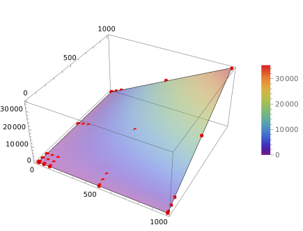

# DESIGN
## Diagramme d'Inhéritance


<details>
    <summary>Mermaid code for the graph</summary>


</details>

## Analyse des performances :
### Génération d'une carte en fonction de n, la taille de la carte en nombre de "cellules":
On parcourt chaque "cellule" de la carte pour y lire le caractère associé, et entre autres opérations en `O(1)`, on appelle sur les blocs qui peuvent faire partie d'une plateforme la fonction `__init__` de la class Path.

Cette fonction utilise `Path.group`, qui est en `O(n)` (en vérité `O` du nombre de blocs du groupe dans lequel le bloc est, donc plus petit que `n`, mais dans le pire des cas `n`), et ensuite itère sur le groupe du blocs et les directions (`O(4n)`), puis sur les directions et la longueur de la liste de déplacement trouvée (`O(4n)`), les flèches sont dans la map), ce qui nous donne au final du `O(9n) = O(n)`.

Au final, on a donc une opération qui traverse les `n` blocs et effectue `9n` opération dessus. On a donc au final une génération de map en `O(n^2)`.

### La fonction update en fonction de k, le nombre d'entités (GameObject) présentes:
On considère ici que la vérification des collisions avec les autres objets est en `O(k)` dans le pire des cas.

Les mécanismes appelés dans le `update` sont tous en `O(1)` ou en `O(k)`. En effet, les seules opérations effectuées dans le `update` sont :

1. Vérification des collisions entres les différents sprites (`O(k)`)
2. Parcourir les `Map#game_objects` pour en sortir un sprite voulue (`O(k)`)
3. Des changements d'états sur les sprites ou appeler des procédures sur d'autres sprites (`O(1)`)

## Benchmarks
Des benchmarks ont été effectués pour appuyer nos arguments de la section analyse des performances. Voici les résultats sous forme de tableaux.

Pour observer le code utilisé pour générer les benchmarks, regarder dans le fichier `tests/test_bench.py`. Attention, ce code ne se lancera uniquement si pytest est invoqué avec :
```sh
uv run pytest --runslow
```
Cette fonctionnalité a été rajouté dû au temps que prenait les benchmarks et au besoin de quand même faire tourner les tests.

### Génération de carte
| Largeur (→), Hauteur (↓) | 1      | 3      | 5      | 10     | 50     | 100    | 500   | 1000  |
|-------------------------:|--------|--------|--------|--------|--------|--------|-------|-------|
|                        1 | 0.69ms | 0.76ms | 0.83ms | 0.66ms | 0.71ms | 0.82ms | 1.2ms | 1.7ms |
|                        3 | 0.76ms | 1.1ms  | 0.94ms | 2.3ms  | 4.3ms  | 7.9ms  | 36ms  | 70ms  |
|                        5 | 0.86ms | 1.2ms  | 1.4ms  | 2.1ms  | 7.5ms  | 15ms   | 69ms  | 140ms |
|                       10 | 1.2ms  | 1.7ms  | 2.4ms  | 4.2ms  | 18ms   | 35ms   | 170ms | 350ms |
|                       50 | 2.6ms  | 5.9ms  | 9.4ms  | 18ms   | 87ms   | 170ms  | 870ms | 1.7s  |
|                      100 | 4.2ms  | 11ms   | 23ms   | 35ms   | 170ms  | 350ms  | 1.7s  | 3.4s  |
|                      500 | 18ms   | 26ms   | 86ms   | 170ms  | 870ms  | 1.7s   | 8.7s  | 18s   |
|                     1000 | 35ms   | 100ms  | 380ms  | 350ms  | 1.7s   | 3.4s   | 18s   | 35s   |

#### Graph
Nous avons graphé nos données sur mathematica afin d'obtenir le plot suivant (avec sa régression linéaire du second ordre) :

```mathematica
model = LinearModelFit[data, {x, y, x^2, y^2, x*y}, {x, y}];

Show[ListPointPlot3D[data, PlotStyle -> Red, BoxRatios -> {1, 1, 0.5}],
  Plot3D[model[x, y], {x, 1, 1000}, {y, 1, 1000}, Mesh -> None,
  PlotStyle -> Opacity[0.5], ColorFunction -> "Rainbow",
  PlotLegends -> Automatic]]
```



Nous voyons bien que les données suivent une progression linéaire du second ordre, ce qui prouve que notre opération est en `O(n^2)`.

### Update
| Largeur (→), Hauteur (↓) | 1       | 3       | 5       | 10      | 50      | 100     | 500     | 1000    |
|-------------------------:|---------|---------|---------|---------|---------|---------|---------|---------|
|                        1 | 0.073ms | 0.076ms | 0.070ms | 0.070ms | 0.070ms | 0.070ms | 0.072ms | 0.070ms |
|                        3 | 0.073ms | 0.24ms  | 0.24ms  | 0.25ms  | 0.31ms  | 0.38ms  | 0.94ms  | 1.6ms   |
|                        5 | 0.080ms | 0.21ms  | 0.23ms  | 0.25ms  | 0.36ms  | 0.50ms  | 1.6ms   | 3.1ms   |
|                       10 | 0.077ms | 0.25ms  | 0.27ms  | 0.30ms  | 0.58ms  | 0.95ms  | 3.8ms   | 7.4ms   |
|                       50 | 0.12ms  | 0.34ms  | 0.40ms  | 0.59ms  | 2.0ms   | 3.7ms   | 18ms    | 37ms    |
|                      100 | 0.16ms  | 0.44ms  | 0.59ms  | 0.94ms  | 3.7ms   | 7.2ms   | 37ms    | 74ms    |
|                      500 | 0.42ms  | 1.3ms   | 2.0ms   | 3.7ms   | 18ms    | 36ms    | 190ms   | 360ms   |
|                     1000 | 0.78ms  | 2.3ms   | 3.7ms   | 7.1ms   | 36ms    | 73ms    | 360ms   | 720ms   |

#### Graph
Nous avons graphé nos données sur mathematica afin d'obtenir le plot suivant (avec sa régression linéaire du second ordre) :
```mathematica
model = LinearModelFit[data, {x, y, x^2, y^2, x*y}, {x, y}];

Show[ListPointPlot3D[data, PlotStyle -> Red, BoxRatios -> {1, 1, 0.5}],
  Plot3D[model[x, y], {x, 1, 1000}, {y, 1, 1000}, Mesh -> None,
  PlotStyle -> Opacity[0.5], ColorFunction -> "Rainbow",
  PlotLegends -> Automatic]]
```


Comme plutôt, nous voyons bien que les données suivent une progression linéaire du second ordre, ce qui prouve que notre opération est en `O(n^2)`.